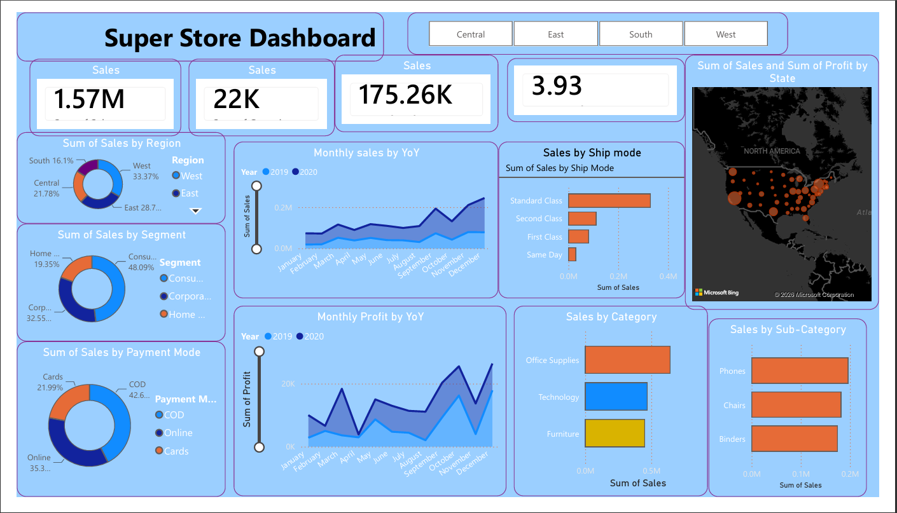
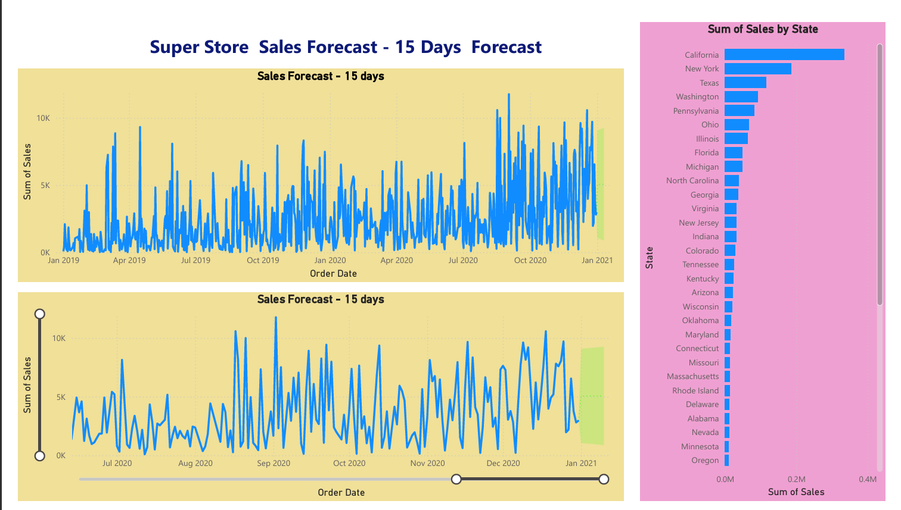

Super Store Sales Dashboard (Power BI)

 Project Overview

This Power BI project analyzes Super Store sales performance using interactive dashboards and provides a 15-day sales forecast.

---

## Dashboard 1 - Sales Analysis

### Features

- Total Sales
- Total Orders
- Total Profit
- Average Delivery Time
- Region Wise Sales
- Category Wise Sales
- Monthly Sales
- Ship Mode Analysis
- State Map

---

## Dashboard 2 - Sales Forecast

### Features

- Sales Forecast (15 Days)
- Historical Sales Trend
- Forecast Visualization
- Top States by Sales

---

## Tools Used

- Power BI Desktop
- Excel
- DAX
- Power Query

---

## Dataset

Super Store Sales Dataset

---

## Skills Demonstrated

- Data Cleaning
- Data Modeling
- DAX Measures
- Interactive Dashboard Design
- Sales Forecasting
- Business Intelligence
